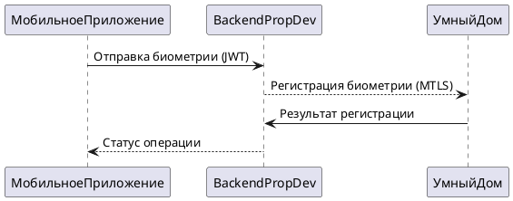
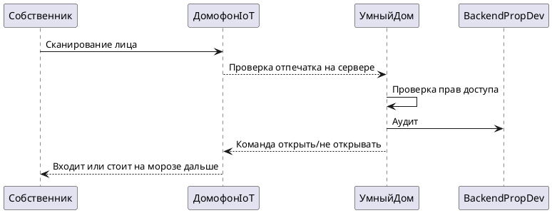

# Диаграмма контекста в модели C4

Для просмотра диаграммы в markdown использую плагин для Visual Studio Code
https://marketplace.visualstudio.com/items?itemName=jebbs.plantuml

### Контекстная диаграмма системы PropDevelopment

```puml

@startuml
!include https://raw.githubusercontent.com/plantuml-stdlib/C4-PlantUML/master/C4_Context.puml

Person(customer, "Собственник", "", $sprite="person")
System(prop_development, "Система PropDevelopment", "Работа с ЖКХ. Информация от УК. Информация о капремонте. Управление умным домом")
Person(admin, "Администратор", "")
System_Ext(devices, "Приборы: домофон, замок, шлагбаум", "")
System_Ext(smart_home, "Система 'Умный дом'", "Находится под управлением партнеров.")

Rel(customer, devices, "Использует при взаимодействии с домофоном/шлагбамом")
Rel(devices, smart_home, "запрос на открытие/закрытие")
Rel(prop_development, smart_home, "Управление данными собсвенников, доступами")
Rel(admin, prop_development, "Регистрирует собственника в системе 'Умный дом' у партнеров")
Rel(customer, prop_development, "Через мобильное приложение регистрирует свою биометрию для домофона, номер машины для шлагбаума")

@enduml
```

### Диаграмма последовательности Регистрация биометрии для домофона



### Диаграмма последовательности Открытие домофона по лицу


### Требования к безопасности

**Авторизация**: 2MF для мобильного приложения собственников

**Шифрование данных**: TLS 1.2+ для всех API-вызовов

**Шифрование биометрии при хранении**: AES-256

**Защита устройств**: Изоляция IoT-устройств в отдельном VLAN

**Мониторинг**: Аудит всех операций с устройствами

### Протоколы аутентификации и авторизации

Для мобильного приложения (авторизация пользователей): **OAuth 2.0**

Внутренние микросервисы: **использование JWT**

Взаимодействие с партнёрской платформой (верификация сертификатов): **MTLS**

