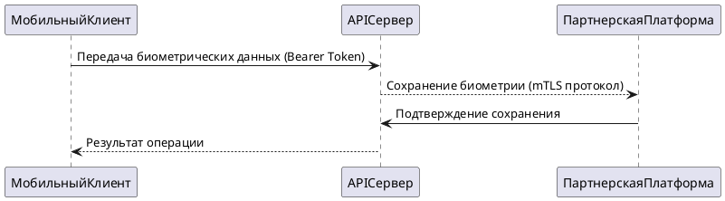
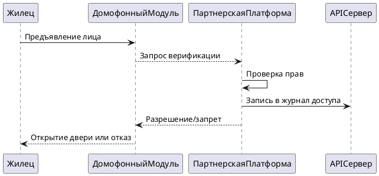

## Контекст системы PropDevelopment

```plantuml
@startuml
!include https://raw.githubusercontent.com/plantuml-stdlib/C4-PlantUML/master/C4_Context.puml

Person(owner, "Владелец недвижимости", "Собственник квартиры/дома", $sprite="person")
System(prop_dev_system, "PropDevelopment", "Управление ЖКХ-услугами, взаимодействие с УК, информация о ремонтах, интеграция с умным домом")
Person(system_admin, "Системный администратор", "Управляет правами доступа")
System_Ext(iot_devices, "IoT-устройства", "Домофонные системы, электронные замки, автоматические ворота")
System_Ext(smart_home_platform, "Платформа умного дома", "Управляется партнерской организацией")

Rel(owner, iot_devices, "Взаимодействует через домофон/ворота")
Rel(iot_devices, smart_home_platform, "Команды управления доступом")
Rel(prop_dev_system, smart_home_platform, "Синхронизация данных жильцов и прав доступа")
Rel(system_admin, prop_dev_system, "Добавляет жильцов в систему умного дома партнера")
Rel(owner, prop_dev_system, "Регистрирует биометрию и автомобильные номера через мобильное приложение")

@enduml
```

## Сценарий: Добавление биометрических данных



## Сценарий: Доступ через распознавание лица



## Требования безопасности системы

**Многофакторная аутентификация**: Обязательна для мобильных приложений владельцев

**Защищенная передача данных**: Минимум TLS 1.2 для всех внешних взаимодействий

**Защита биометрических данных**: Шифрование AES-256 при хранении

**Сетевая изоляция IoT**: Выделенная VLAN для устройств интернета вещей

**Аудит операций**: Логирование всех действий с IoT-устройствами

## Используемые протоколы безопасности

**Аутентификация пользователей мобильного приложения**: OAuth 2.0

**Межсервисное взаимодействие**: JWT токены

**Интеграция с партнерами**: mTLS (взаимная аутентификация сертификатов)